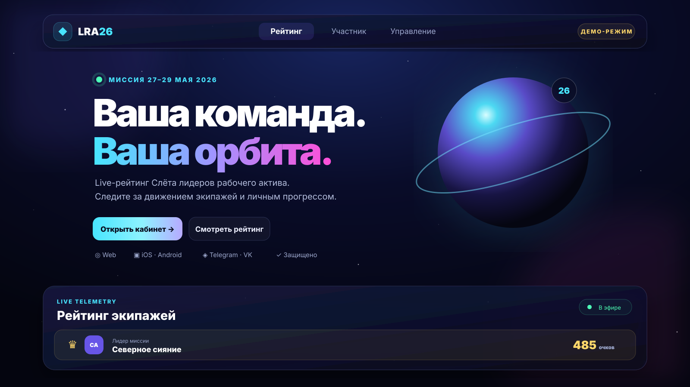

<div align="center">


# LRA-26 · Live Space Ranking

Космическая платформа соревнований для Web, iOS, Android, Telegram и VK.

[](https://github.com/Saborrr/lra26/actions/workflows/ci.yml)
[](https://github.com/Saborrr/lra26/actions/workflows/codeql.yml)
[](https://www.djangoproject.com/)
[](https://react.dev/)
[](https://web.dev/explore/progressive-web-apps)
[](LICENSE)

**Русский** · [English](README_EN.md)

</div>



> Скачали репозиторий ZIP-архивом? Откройте корневой файл `index.html` двойным щелчком. Это автономный интерактивный макет с демонстрационными данными, который не требует установки Python, Node.js или базы данных.

## Возможности

- Публичный live-рейтинг с WebSocket и резервным обновлением по HTTP.
- Устанавливаемое PWA для iPhone, iPad и Android.
- Telegram Mini App и безопасный Telegram-бот.
- VK Mini App через официальный VK Bridge.
- Кабинет участника с командой, баллами и активными заданиями.
- Панель администратора для команд, квестов, результатов и штрафов.
- Отдельная роль суперадминистратора для пользователей, прав и журнала действий.
- Одноразовые 15-минутные коды привязки Telegram/VK.
- PostgreSQL, Redis, Django Channels, Docker Compose и reverse proxy.

## Роли

| Роль | Возможности |
|---|---|
| Участник | Публичный рейтинг, свой кабинет, команда и задания |
| Администратор | Управление командами, квестами, результатами, штрафами и кодами участников |
| Суперадминистратор | Все права администратора, управление пользователями и ролями, полный audit log |

Публичные пользователи не могут читать внутренние результаты и изменять данные. Все изменения баллов и штрафов записываются в журнал.

## Архитектура

```text
Browser / PWA / Telegram / VK
              │
      /lra26/ · HTTPS
              │
         Nginx frontend
          ├── React PWA
          ├── /api → Django REST
          └── /ws  → Django Channels
                       ├── PostgreSQL
                       └── Redis

Telegram bot → Django services → PostgreSQL
```

На production наружу публикуется только `127.0.0.1:8088`. PostgreSQL, Redis и Django находятся во внутренней Docker-сети и не занимают публичные порты.

## Быстрый локальный запуск

### Посмотреть дизайн без установки

Откройте файл `index.html` из корня репозитория в Chrome, Edge, Firefox или Safari. В верхнем меню можно переключаться между публичным рейтингом, кабинетом участника и панелью администратора. Это демонстрация интерфейса: формы и данные в ней не сохраняются.

### Запустить настоящее приложение

Требуются Python 3.12+, Node.js 22+ и Redis при проверке WebSocket.

```bash
cd backend
python -m venv .venv
source .venv/bin/activate
pip install -r requirements/development.txt
export SECRET_KEY=local-development-key
python manage.py migrate
python manage.py createsuperuser
python manage.py runserver
```

Во втором терминале:

```bash
cd frontend
npm ci
npm run dev
```

Откройте `http://localhost:5173/lra26/`.

## Production на gofaraway.mooo.com/lra26/

Полная пошаговая инструкция находится в [docs/DEPLOYMENT.md](docs/DEPLOYMENT.md).

Кратко:

```bash
cp .env.example .env
# Заполнить SECRET_KEY, POSTGRES_PASSWORD и интеграционные секреты
docker compose build
docker compose up -d
docker compose exec backend python manage.py createsuperuser
```

Затем добавьте [готовый location-блок](deploy/nginx-lra26.conf) в существующий HTTPS-конфиг `gofaraway.mooo.com` и выполните проверку конфигурации Nginx.

## Telegram и VK

Telegram-бот поддерживает `/start`, `/teams`, `/myteam`, `/login КОД` и административный `/addscore`. Кнопка запуска открывает тот же PWA внутри Telegram. Сервер проверяет подпись `initData` и срок её действия.

VK-сборка использует официальный `@vkontakte/vk-bridge`. Подписанные launch parameters проверяются на сервере с `VK_APP_SECRET`. Идентификаторы платформ не принимаются от клиента без проверки подписи.

## Проверки

```bash
cd backend
ruff check .
ruff format --check .
pytest --cov=apps --cov-fail-under=80
pip-audit -r requirements/production.txt

cd ../frontend
npm ci
npm run check
npm run build
npm audit --omit=dev
```

GitHub Actions дополнительно выполняет CodeQL и сборку обоих Docker-образов. Dependabot следит за Python, npm, Docker и Actions.

## Безопасность

- Argon2 для паролей, короткоживущий access JWT и HttpOnly refresh cookie.
- Ротация и blacklist refresh-токенов.
- Rate limit для входа и platform-auth.
- Проверка максимальных баллов и положительности штрафа на API и уровне БД.
- Origin validation для WebSocket.
- CSP, `nosniff`, Referrer Policy и запрет лишних browser permissions.
- Контейнеры без root, с read-only filesystem и `no-new-privileges`.
- Секреты только через `.env`, который исключён из Git.
- Audit log для привилегированных операций.

Уязвимости следует сообщать приватно по правилам [SECURITY.md](SECURITY.md).

## Автор

**Aleksandr Fadeev** · [@Saborrr](https://github.com/Saborrr)

Проект распространяется по лицензии [Apache 2.0](LICENSE).
