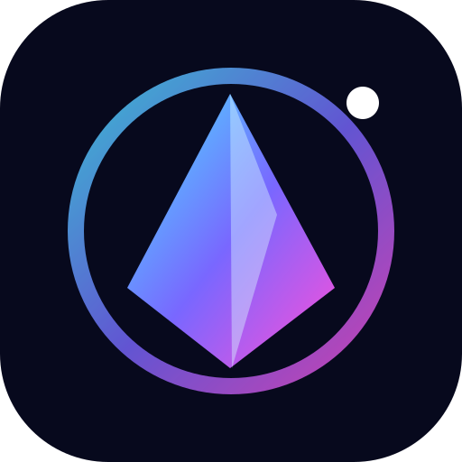

# LRA-26 · Live Space Ranking

A secure space-themed competition platform for Web, iOS, Android, Telegram, and VK.

[Русский](README.md) · **English**

## Highlights

- Live public leaderboard powered by WebSockets with an HTTP fallback.
- Installable PWA for iPhone, iPad, and Android.
- Telegram Mini App, Telegram bot, and VK Mini App adapters.
- Participant dashboard with team progress and active quests.
- Administrator mission control for teams, quests, scores, and penalties.
- Super administrator console for accounts, roles, link codes, and the audit trail.
- PostgreSQL, Redis, Django Channels, React 19, and Docker Compose.

The production application is designed to be served at `https://gofaraway.mooo.com/lra26/`. Only the frontend proxy binds to localhost; the database, Redis, and Django remain inside a private Docker network.

See [the Russian README](README.md) and [deployment guide](docs/DEPLOYMENT.md) for complete setup instructions.

## Security

The project validates Telegram and VK signed launch data on the server, uses Argon2 passwords, short-lived access tokens, rotating HttpOnly refresh cookies, role-based permissions, throttling, database constraints, WebSocket origin validation, hardened containers, and an append-only application audit trail.

Please report vulnerabilities privately according to [SECURITY.md](SECURITY.md).

## Author

**Aleksandr Fadeev** · [@Saborrr](https://github.com/Saborrr)

Released under the [Apache 2.0 License](LICENSE).
